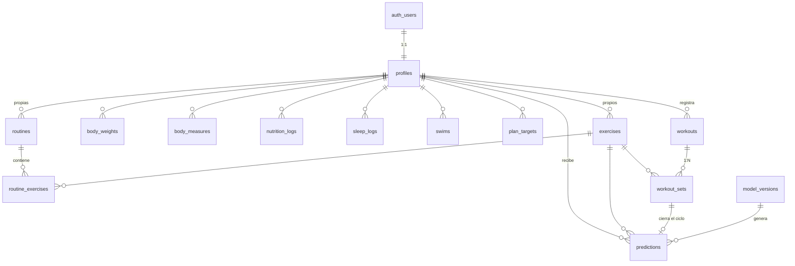

# Esquema de datos · GymAI

Diseño de la base que sustenta el modelo predictivo de progresión de cargas.
14 tablas, 9 vistas, RLS en todas.

---

## 1. De dónde venimos

La app actual es un PWA de un solo archivo que guarda todo en `localStorage` bajo la
llave `gymDiary_gabo_v1`, con esta forma:

```js
{ weights:[], measures:[], workouts:[], swims:[], sleep:[], cfg:{} }
```

Tres problemas que el esquema nuevo resuelve:

| Problema | Consecuencia | Solución |
|---|---|---|
| No se captura RIR ni RPE | Sin variable objetivo no hay aprendizaje supervisado | Columna `workout_sets.rir` |
| No se registra ingesta, solo una meta calórica estática (`KCAL(w)`) | La hipótesis H2 del anteproyecto no es verificable | Tabla `nutrition_logs` |
| Ejercicios son strings dentro de `ROUTINES`, macheados por nombre exacto en `lastFor()` | El historial se rompe si cambia una tilde; no hay atributos por ejercicio | Tabla `exercises` con IDs y atributos |

---

## 2. Diagrama



---

## 3. Tablas

### Núcleo del modelo

**`workout_sets`** — la tabla más importante del proyecto.

| Columna | Tipo | Nota |
|---|---|---|
| `weight_kg` | numeric(6,2) | Carga |
| `reps` | integer | Repeticiones |
| **`rir`** | numeric(3,1) | **Repeticiones en reserva.** Nullable a propósito: mejor un faltante que un inventado. `NULL` se excluye del entrenamiento supervisado |
| `to_failure` | boolean | Serie llevada al fallo |
| `is_warmup` | boolean | Las de calentamiento se excluyen de todo análisis |
| `volume_kg` | generated | `weight_kg × reps`, calculado por Postgres |
| `e1rm_kg` | generated | Epley: `weight_kg × (1 + reps/30)`, la misma fórmula que ya usa la app |

Las columnas generadas evitan duplicar la lógica en el cliente y garantizan que el
dataset y la interfaz nunca se contradigan.

**`exercises`** — catálogo. `owner_id IS NULL` significa catálogo global; con valor,
es un ejercicio propio del usuario. `load_increment_kg` guarda el incremento mínimo
realista (2.5 kg en barra, 5 kg en máquina) y define además la tolerancia del modelo:
el criterio de éxito del anteproyecto es MAE < 1 incremento.

**`routine_exercises`** — `target_rir_min` / `target_rir_max` definen operativamente el
objetivo del modelo: *la carga que deja al usuario dentro de esta ventana*.

### Contexto

`profiles` (antropometría, experiencia, `research_consent`), `body_weights`,
`body_measures`, `sleep_logs`, `swims`, `plan_targets`.

**Alta de participantes.** `profiles` incluye `training_days_per_week`,
`target_weight_kg`, `target_waist_cm` y `onboarded_at`. Con esos campos la app arma para
cada persona su propia curva de peso y calorías, en lugar de heredar el plan del autor.
La curva se guarda semana a semana en `plan_targets`. `onboarded_at` es lo que evita que
el cuestionario se repita al iniciar sesión en otro dispositivo.

El catálogo tiene **8 rutinas globales**: cinco del split original (4 o 5 días) y tres de
cuerpo completo para quien solo puede entrenar 3. Qué rutinas ve cada participante lo
decide `training_days_per_week`. El modelo es personalizado, así que no necesita que
todos entrenen igual; lo que sí necesita es que sostengan el registro ocho semanas, y
para eso importa más la adherencia que la uniformidad.

**`nutrition_logs`** es nueva. `source` distingue `manual` de `estimated`: solo lo
capturado por el usuario cuenta como evidencia. Sin filas con `source = 'manual'`,
la hipótesis H2 no se puede probar.

### Trazabilidad

**`model_versions`** — cada modelo entrenado con sus métricas en `jsonb`.
Índice único parcial: solo un modelo activo por tipo.

**`predictions`** — cada prescripción que el sistema emite, con el snapshot de las
variables usadas. Un trigger (`close_prediction_loop`) liga la predicción con la serie
que el usuario realmente ejecutó y calcula `error_kg`.

Esto es lo que convierte el desarrollo en investigación: permite medir el MAE **en
producción**, no solo en el conjunto de prueba. También registra `clamped`, que dice
cuántas veces la capa de seguridad tuvo que corregir al modelo.

---

## 4. Vistas

| Vista | Para qué |
|---|---|
| `v_working_sets` | Series efectivas con usuario y fecha |
| `v_exercise_sessions` | Una fila por usuario × ejercicio × sesión |
| **`v_ml_dataset`** | **Dataset de entrenamiento, listo para `pandas.read_sql`** |
| `v_body_fat` | % de grasa por fórmula Navy |
| `v_weekly_volume` | Tonelaje semanal (gráfica `chVol`) |
| `v_personal_records` | Récords (tabla `prTable`) |
| `v_admin_participantes` | Panel: adherencia, % de RIR y consentimiento por participante |
| `v_admin_progreso` | Panel: tonelaje y 1RM estimado por semana |
| `v_admin_ejercicios` | Panel: 1RM inicial contra máximo, por ejercicio |

### `v_ml_dataset`

Una fila por sesión, con todo pre-calculado:

- **Perfil:** `sex`, `age_years`, `height_cm`, `experience_months`, `goal`
- **Ejercicio:** `muscle_group`, `movement_pattern`, `equipment`, `is_compound`
- **Desempeño:** `top_weight_kg`, `top_e1rm_kg`, `total_volume_kg`, `avg_rir`, `min_rir`
- **Rezagos:** `prev1_weight_kg` … `prev3_weight_kg`, `prev1_avg_rir`, `prev2_avg_rir`, `pct_change_vs_prev`
- **Recuperación:** `days_since_prev_session`, `sleep_h_7d`, `bodyweight_7d_kg`
- **Nutrición:** `kcal_balance_7d`, `protein_g_per_kg_7d`, `days_logged_7d`
- **Objetivo:** `target_next_weight_kg`, `target_delta_kg`

No hay fuga temporal: cada fila solo usa información anterior o de la propia sesión.
El objetivo viene de un `LEAD` sobre la ventana del mismo usuario y ejercicio.

```sql
select * from v_ml_dataset
where research_consent
  and target_next_weight_kg is not null
  and session_no >= 3;
```

---

## 5. Seguridad

RLS activo en las 14 tablas. Cada usuario ve y escribe solo sus filas
(`auth.uid() = user_id`); `workout_sets` hereda del `workout` padre. El catálogo global
es de lectura para todos y solo el dueño edita el suyo.

Las vistas usan `security_invoker = on`, así que respetan las políticas de quien
consulta y no las del creador. Las funciones de trigger tienen `search_path` fijo y
`EXECUTE` revocado de `anon` y `authenticated`, para que no sean invocables por la API
REST.

**Investigador.** `profiles.is_admin` concede **solo lectura** sobre los datos del
estudio. Las políticas lo resuelven con `private.es_admin()`, una función
`SECURITY DEFINER` en un esquema que PostgREST no expone — consultar `profiles` desde una
política sobre `profiles` causaría recursión infinita, y dejarla en `public` la publicaría
como endpoint. El panel **no usa la llave `service_role`**: el sitio es estático y público.

Verificado con JWT real bajo el rol `authenticated`: el investigador lee a todos los
participantes, cada participante se ve solo a sí mismo, y un `update` del investigador
sobre datos ajenos modifica 0 filas.

Linter de Supabase: 0 avisos de seguridad.

---

## 6. Consideraciones éticas

`profiles.research_consent` es el interruptor. En `false` (el valor por defecto), el
usuario queda fuera del dataset de entrenamiento aunque sus datos existan.
`consent_granted_at` se sella por trigger y se limpia si el consentimiento se retira.
Todas las consultas de entrenamiento deben filtrar por esta columna.

---

## 7. Sincronización

`workouts` y `swims` no tienen llave natural (puede haber dos sesiones el mismo día),
así que llevan `client_uid`: un UUID que genera el dispositivo. Con eso el `upsert` es
idempotente y sincronizar dos veces no duplica.

> **Nota de diseño.** La primera versión usaba un índice único *parcial*
> (`where client_uid is not null`). Postgres no lo puede usar en `ON CONFLICT` sin
> repetir el predicado, y `supabase-js` no permite expresarlo en
> `.upsert({onConflict:'user_id,client_uid'})`. La migración 12 lo cambió a
> `NOT NULL` con restricción única normal.

El cliente es offline-first: guarda en `localStorage` primero y sube después, con un
retraso de 3 segundos tras el último cambio. Sin sesión o sin red, la app funciona igual
que antes. La resolución de conflictos es *última escritura gana*, lo cual es suficiente
mientras cada cuenta la use una sola persona.

---

## 8. Estado

Hecho:

1. Esquema completo, con RLS, verificado bajo el rol `authenticated`.
2. `index.html` migrado a Supabase: cuenta, sincronización automática y modo local.
3. **Captura de RIR por serie**, con meta por ejercicio visible en la interfaz.
4. Pestaña de comida que alimenta `nutrition_logs`.
5. Consentimiento de investigación conectado a `profiles.research_consent`.
6. Alta guiada de participantes: cuenta, cuestionario, plan calculado y rutinas asignadas
   según los días que cada quien pueda entrenar.
7. Borrador de sesión: lo capturado se guarda en el dispositivo mientras se entrena y se
   restaura si la app se cierra antes de guardar.
8. Rutina propia con diagnóstico por reglas, para participantes con 3+ años de experiencia.
9. Panel del investigador (`panel.html`) con acceso de solo lectura, vía `profiles.is_admin`
   y la función `private.es_admin()`.

Pendiente:

1. Servicio de inferencia en Python que consuma `v_ml_dataset` (fase 3).
2. Capa de restricciones de seguridad sobre la salida del modelo.
3. Escribir en `predictions` desde la app para cerrar el ciclo de medición.
